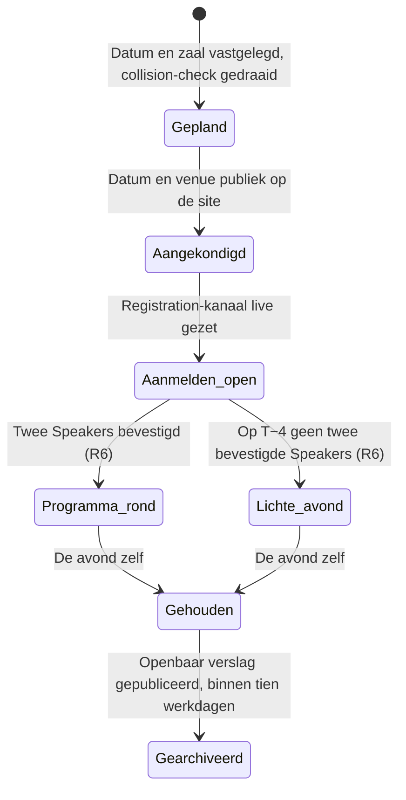

# Entities — twente.dev

*Generated from `model.yaml` — do not edit by hand.*

## Edition
*Context: Editie*

Eén genummerde avond, van datumbesluit tot gepubliceerd verslag.

| Attribute | Type | Required | Description |
|---|---|---|---|
| `number` | `string` | yes | Drie cijfers, permanent. Vormt de URL en de naam. |
| `theme` | `string` | yes | Eén woord dat de avond typeert, bijvoorbeeld Reconnect. |
| `date` | `datetime` | yes | Doorgaans de eerste woensdag van de maand. Let op de winter/zomertijdovergang. |
| `capacity` | `int` | yes | Wat de zaal echt kan, niet wat we hopen. |
| `speakers` | `Speaker[]` |  | Leeg tot bevestigd. De lengte bepaalt wat de pagina toont. |

**Relationships**
- has_many **Talk** — Twee bij een volwaardige Edition, nul bij een lichte avond.
- references **Host** — De organisatie die de zaal levert.

**Lifecycle**

## Talk
*Context: Editie*

Twaalf minuten gesproken, één claim, één voorbeeld, één vraag.

| Attribute | Type | Required | Description |
|---|---|---|---|
| `claim` | `string` | yes | Een precieze stelling, geen onderwerplabel. |
| `example` | `string` | yes | Het besluit, de mislukking of het resultaat dat de claim toetsbaar maakt. |
| `question` | `string` | yes | Het onopgeloste deel waar de zaal bij kan helpen. |

**Relationships**
- belongs_to **Speaker** — Precies één Speaker per Talk.
- belongs_to **Edition**

## Host
*Context: Editie*

De organisatie die de zaal levert, onder de waarborgen van R4.

| Attribute | Type | Required | Description |
|---|---|---|---|
| `organisation` | `string` | yes |  |
| `address` | `string` | yes | Staat op de editiepagina, want mensen boeken er reizen op. |
| `editionsCommitted` | `int` |  | Expliciet eindig, en publiek gecommuniceerd als zodanig. |

**Relationships**
- has_many **Edition** — Een Host kan meerdere Editions achter elkaar leveren.

## Speaker
*Context: Editie*

Degene die een Talk geeft.

| Attribute | Type | Required | Description |
|---|---|---|---|
| `name` | `string` | yes |  |
| `affiliation` | `string` |  | Waar iemand bouwt. Een bedrijf, lab of school, geen functietitel. |
| `confirmedAt` | `datetime` |  | Leeg betekent niet publiceren (R5). |

**Relationships**
- has_one **Talk**
