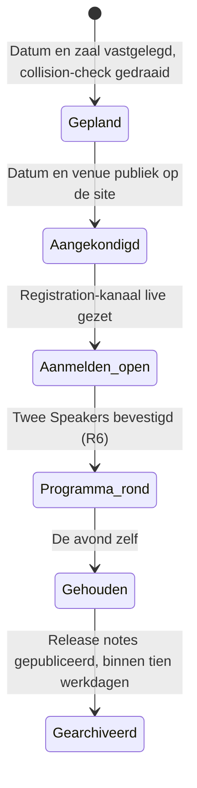

# Entities — twente.dev

*Generated from `model.yaml` — do not edit by hand.*

## Release
*Context: Release-context*

Eén genummerde avond, van datumbesluit tot gepubliceerd verslag.

| Attribute | Type | Required | Description |
|---|---|---|---|
| `number` | `string` | yes | Drie cijfers, permanent. Vormt de URL en de naam. |
| `theme` | `string` | yes | Eén woord dat de avond typeert, bijvoorbeeld Reconnect. |
| `date` | `datetime` | yes | Doorgaans de eerste woensdag van de maand. Let op de winter/zomertijdovergang. |
| `capacity` | `int` | yes | Wat de zaal echt kan, niet wat we hopen. |
| `venue` | `Venue` | yes | De zaal van deze avond. Kan per Release wisselen. |
| `slots` | `Slot[]` | yes | Er zijn er altijd twee. Gevuld of leeg, nooit meer of minder. |

**Relationships**
- has_many **Talk** — Twee bij een volwaardige Release, nul bij een lichte avond.
- references **Host** — De organisatie die de zaal levert.

**Lifecycle**

## Talk
*Context: Release-context*

Ongeveer een halfuur gesproken over eigen werk.

| Attribute | Type | Required | Description |
|---|---|---|---|
| `title` | `string` | yes | De titel zoals die op de releasepagina en in het programma staat. |
| `subject` | `string` | yes | Het systeem, de migratie of het besluit waar de talk over gaat. |

**Relationships**
- belongs_to **Speaker** — Precies één Speaker per Talk.
- belongs_to **Release**

## Host
*Context: Release-context*

De organisatie die de zaal levert, onder de waarborgen van R4.

| Attribute | Type | Required | Description |
|---|---|---|---|
| `organisation` | `string` | yes |  |
| `releasesCommitted` | `int` |  | Het aantal releases dat publiek is toegezegd. Eindig, en hoogstens wat de host werkelijk heeft toegezegd. |

**Relationships**
- has_many **Release** — Een Host kan meerdere Releases achter elkaar leveren.
- has_one **Venue** — De ruimte die de Host beschikbaar stelt.

## Venue
*Context: Release-context*

De ruimte waar een Release gehouden wordt.

| Attribute | Type | Required | Description |
|---|---|---|---|
| `name` | `string` | yes | Hoe de plek heet in de zaal en op de kaart. |
| `address` | `string` | yes | Staat op de releasepagina, want mensen boeken er reizen op. |
| `city` | `string` | yes | Een van de gemeenten uit Twente. |

**Relationships**
- has_many **Release** — Een Venue kan meerdere Releases herbergen.

## Slot
*Context: Release-context*

Een van de twee programmaplaatsen van een Release.

| Attribute | Type | Required | Description |
|---|---|---|---|
| `position` | `int` | yes | 1 of 2. Bepaalt de volgorde op de avond. |
| `talk` | `Talk` |  | Leeg tot een Speaker de datum bevestigd heeft. |

**Relationships**
- has_one **Talk** — Een gevuld Slot draagt precies een Talk.

## Speaker
*Context: Release-context*

Degene die een Talk geeft.

| Attribute | Type | Required | Description |
|---|---|---|---|
| `name` | `string` | yes |  |
| `affiliation` | `string` |  | Waar iemand bouwt. Een bedrijf, lab of school, geen functietitel. |
| `confirmedAt` | `datetime` |  | Leeg betekent niet publiceren (R5). |

**Relationships**
- has_one **Talk**
