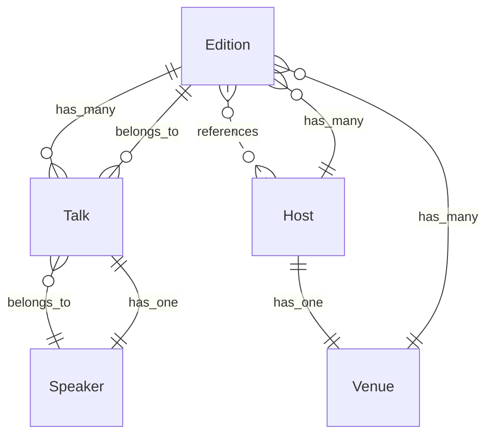

# twente.dev — Domain Overview

De onafhankelijke, practitioner-led techcommunity van Twente. Een gezamenlijke agenda, een directory, een archief en een nieuwsbrief het hele jaar door, plus een klein aantal genummerde, bewust multidisciplinaire avonden.

*Model version 1.0.0. Generated from `model.yaml` — do not edit by hand.*

## Bounded contexts

- **Editie** — De avond zelf en alles wat eromheen geregeld moet worden: datum, zaal, programma, aanmelden. Hier is "praten" een Talk en is een Editie een gebeurtenis met een datum.
- **Publicatie** — Wat er geschreven en verstuurd wordt: artikelen op de site en de mail die erover gaat. Hier heeft een stuk een Pillar in plaats van een spreker, en is er geen zaal en geen datum.

## Entity relationships

## Contents

- [Glossary](glossary.md)
- [Entities](entities.md)
- [Business rules](rules.md)
- [Domain events](events.md)
