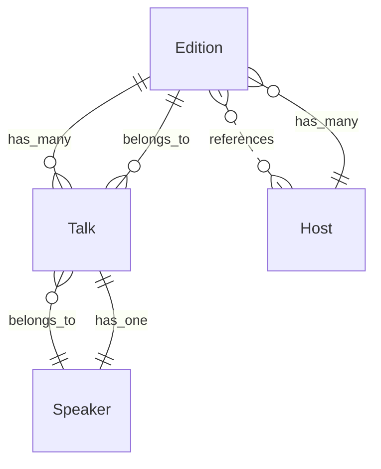

# twente.dev — Domain Overview

De onafhankelijke, practitioner-led techcommunity van Twente. Een gezamenlijke agenda, een directory, een archief en een nieuwsbrief het hele jaar door, plus een klein aantal genummerde, bewust multidisciplinaire avonden.

*Model version 0.1.0. Generated from `model.yaml` — do not edit by hand.*

## Bounded contexts

- **Editie** — De avond zelf en alles wat eromheen geregeld moet worden: datum, zaal, programma, aanmelden. Hier is "praten" een Talk en is een Editie een gebeurtenis met een datum.
- **Publicatie** — Wat er geschreven en verstuurd wordt: artikelen op de site en de mail die erover gaat. Hier is "praten" schrijven, en hebben stukken een pillar in plaats van een spreker. De woordbotsing die dit model oplost zit precies op de grens tussen deze twee contexten.

## ⚠ Open ambiguities

These terms are contested or vague. Resolve them before writing specs that depend on them.

- **field note** — Drie betekenissen tegelijk in gebruik. (1) De pillar field-notes in content.config.ts, gedefinieerd als "één concrete les uit een lokaal systeem". (2) De naam van de nieuwsbrief op de homepage, "De field note", die alle pillars verstuurt en dus meer dekt dan de pillar. (3) Ryans uitspraak op 2026-09-04 dat field notes "echt de interviews met developers zijn", wat de betekenis van People Who Build is.
  - Options: Field Note = de pillar "één concrete les"; de nieuwsbrief krijgt een eigen naam, Field Note = koepel voor alles wat geschreven en gemaild wordt; de pillar "één concrete les" krijgt een nieuwe naam, Field Note = de interviews; People Who Build vervalt als aparte naam
  - Recommendation: Optie 1. Het laat de vier pillars staan zoals ze zijn gebouwd en verzonden, en repareert de enige echte overlap: een nieuwsbrief die naar één van zijn vier pillars is vernoemd, belooft abonnees minder dan hij levert. Optie 3 valt af omdat Ryan People Who Build juist wil houden, en dan zijn het twee namen voor één ding.

## Entity relationships

## Contents

- [Glossary](glossary.md)
- [Entities](entities.md)
- [Business rules](rules.md)
- [Domain events](events.md)
